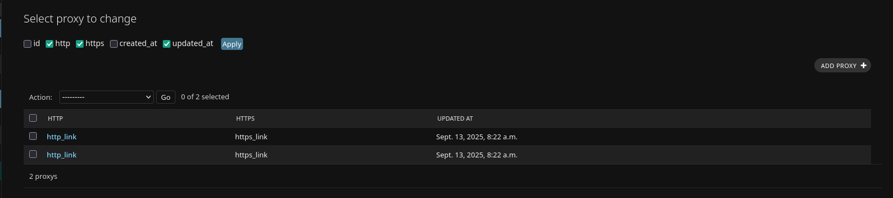

# django-dynamic-list-display

A reusable Django admin mixin that allows administrators to **dynamically choose which fields are displayed** in the changelist view using simple checkboxes.


Django==6.0.6
---

## ✨ Features

- Add a field selector to the Django Admin changelist view.
- Remember user-selected fields via Django session.
- Easy to integrate into any `ModelAdmin`.
- Works alongside default admin features (search, filters, pagination).

---

## 📦 Installation

```bash
pip install git+https://github.com/Nikita-Goncharov/django-dynamic-list-display.git@master
````

---

## ⚙️ Usage

1. Add `dynamic_list_display` to your `INSTALLED_APPS`:

```python
INSTALLED_APPS = [
    ...,
    "dynamic_list_display",
]
```

2. Create your admin class by extending `DynamicFieldsModelAdmin`:

```python
from django.contrib import admin
from dynamic_list_display.admin import DynamicFieldsModelAdmin
from .models import MyModel


@admin.register(MyModel)
class MyModelAdmin(DynamicFieldsModelAdmin):
    default_fields = ["id", "name", "created_at"]
```

3. Done ✅ — now, in the Django Admin list page, you'll see a field selector above the table.

---

## 🧩 How It Works

* The admin template (`change_list_dynamic_fields.html`) extends the default `change_list.html`.
* A form with checkboxes is injected above the changelist view.
* Selected fields are saved in the session.
* The table updates dynamically based on the selection.

---

## 🧩 How It looks like

---

## 📂 Project Structure

```
dynamic_list_display/
│
├── admin.py          # Contains DynamicFieldsModelAdmin
├── templates/
│   └── dynamic_list_display/
│       └── change_list_dynamic_fields.html
├── __init__.py
└── ...
```

---

## 📜 License

This project is licensed under the [MIT License](LICENSE).

---

## 👤 Author

**Nik**
📧 [nikitagoncarov657@gmail.com](mailto:nikitagoncarov657@gmail.com)
🔗 [GitHub](https://github.com/Nikita-Goncharov)

---

## ⭐ Contributing

Pull requests are welcome!
If you have ideas, bug reports, or improvements, feel free to open an issue or PR.